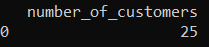
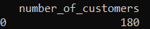
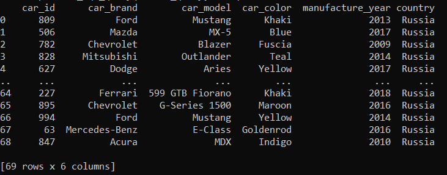
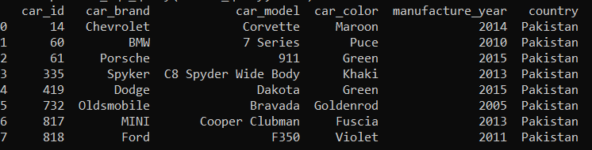
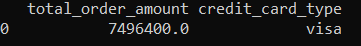
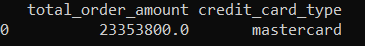

# Postgres Data Architecture project

## Description

The database is used to keep records of orders where each order contain information about the customer and the car, that customer was purchased.

The database contains 3 tables:
 - "customers" with columns: customer_id (Primary key),  first_name,  last_name, country, phone_number, email_address
 - "cars" with columns: car_id (Primary key), car_brand, car_model, car_color, manufacture_year
 - "orders" with columns: order_id (Primary key), customer_id (Foreign key), car_id (Foreign key), credit_card_type, order_amount.

These columns collectively provide comprehensive insights into customer demographics, vehicle details, and payment information.

## Links to data source

1) https://www.kaggle.com/datasets/iamsouravbanerjee/cars-dataset
2) https://www.kaggle.com/datasets/avikasliwal/used-cars-price-prediction

The dataset was obtained from combining these two csv files and transforming into 3NF.

## Specific outputs / Functionality

### 1) Print number of customers with total order_amount less or greater than "order_amount"
Require:
 - query number (1)
 - condition ("greater", "less")
 - order_amount (any number)
```bash
python data_query.py --query=1 --condition=greater --order_amount=1500000
```

```bash
python data_query.py --query=1 --condition=less --order_amount=100000
```


### 2) print all cars that were sent to customer to country = "country"
Require:
 - query number (2)
 - country (any country)
```bash
python data_query.py --query=2 --country=Russia
```

```bash
python data_query.py --query=2 --country=Pakistan
```


### 3) print sum of order_amount made with credit_card_type = "credit_card_type"
Require:
 - query number (3)
 - credit_card_type (any credit_card_type)

Possible options for credit_card_type:
'americanexpress', 'jcb', 'diners-club-us-ca', 'diners-club-carte-blanche', 
'diners-club-enroute', 'mastercard', 'china-unionpay', 'bankcard', 'switch', 
'laser', 'maestro', 'instapayment', 'solo', 'visa-electron', 'diners-club-international', 'visa'

```bash
python data_query.py --query=3 --credit_card_type=visa
```

```bash
python data_query.py --query=3 --credit_card_type=mastercard
```

